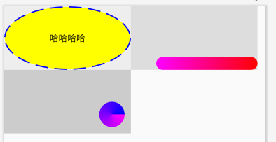

# Shape背景的xml化

### 所有属性和shape xml保持一致，不和background冲突

android:shape：类型必须设置：rectangle、oval、line、ring

shapeSolidColor：内部填充色

shapeCornersRadius、shapeCornersTopLeftRadius、shapeCornersTopRightRadius、shapeCornersBottomLeftRadius、shapeCornersBottomRightRadius：四边圆角

shapeSizeWidth、shapeSizeHeight：写死宽/高度（用于wrap的控或使用shapeGravity属性）

shapeGravity：至少指定shapeSizeWidth/Height之一。shape在view的位置：left、top、right、bottom、center及left|top、right|top、left|bottom、right|bottom，共9种

shapeMargin、shapeMarginLeft、shapeMarginTop、shapeMarginRight、shapeMarginBottom：shape距view四边距离

shapeGradientType：渐变类型，渐变时必须设置：linear、radial、sweep

shapeGradientCenterX、shapeGradientCenterY：渐变中间x/y坐标，支持绝对值和百分比，如：100或50%

shapeGradientStartColor、shapeGradientCenterColor、shapeGradientEndColor：渐变开始/中间/结束色

shapeGradientAngle：渐变方向角度，支持45的倍数，如：360

shapeGradientRadius：渐变中间圆大小，如：100dp。~~原xml支持百分比，但受反射限制并且高api没有对应方法，暂时不做（可用曲线救国实现）~~

shapeInnerRadius：圆环内环大小，shape要为ring，如：100dp

shapeInnerRadiusRatio：内环大小占比，以shape宽为基础除以该值，如内环和宽一样：2

shapeThickness：环的厚度

shapeThicknessRatio：环的厚度占比，以shape宽为基础除以该值，如撑满：2

~~shapePadding：内边距，实际上就是view的padding，还有bug，请直接使用view的padding~~

~~shapeUseLevel属性：歧义特多，几乎没啥用，暂时不做~~

示例：

```
<com.foundation.widget.shape.ShapeTextView或ShapeFrameLayout或ShapeView
    android:layout_width="match_parent"
    android:layout_height="match_parent"
    android:shape="oval"//必须
    app:shapeSolidColor="#00f"//其他以shape开头的属性
     />

    tv.buildShape()
        .apply {
            setShape(GradientDrawable.RECTANGLE)
            setCornersRadius(100)
        }
```

### 效果如图：



### 补充shape额外相关知识

1.自己搜索shape教程，一大堆

2.想直接看源码解释：xml打出”android:shape="oval"，点进去，所有以“GradientDrawable”开头的styleable均是
### 依赖方式：

首先要配置腾讯云的maven，一般都有，不多说
```
"com.foundation.widget:Shape:0.0.1-SNAPSHOT"
```